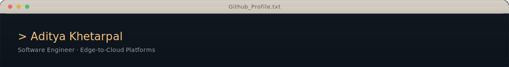

<!--
  Hi, and welcome to my GitHub profile.
  Built around production systems, connected devices, and reliability-first engineering.
-->

  
  

 

  Reliable edge-to-cloud software engineer building production-grade firmware, native mobile, offline-first sync, and backend systems that stay correct, observable, and recoverable under real-world constraints.

## Focus Areas

**Embedded systems**  
Reliability-first firmware for connected devices, including BLE transport, OTA recovery, low-power behavior, calibration, and constrained on-device intelligence.

**Mobile runtimes**  
Native iOS and Android communication layers built for BLE connectivity, reconnection, restoration, background-safe execution, and large health-data backfills.

**Offline-first data & sync**  
SQLite-first product flows, transactional outbox patterns, cursor-based sync, tombstones, retries, and reconciliation paths that stay correct through long offline windows.

**Backend reliability**  
Queue-backed workers, realtime delivery, bounded processing pipelines, and observability-first APIs designed to degrade deliberately rather than fail invisibly.

**Intelligence & personalization**  
TinyML and product-facing intelligence grounded in trusted data paths, explicit controls, structured memory, and interpretable fallback behavior.

<!-- Add project links back once final repo URLs are ready. Plain titles are cleaner than placeholder links. -->
## Selected Projects

### ESP32-S3 Edge Firmware Platform
Dual-core FreeRTOS firmware with binary BLE transport, OTA recovery, deep sleep handling, calibration logic, and on-device intelligence.

### Offline-First Mobile Device Platform
Native BLE runtime, health ingestion pipelines, SQLite-first UX, and transactional sync architecture designed for intermittent networks and interrupted sessions.

### Device Cloud & Sync Backend
Queue-backed workers, realtime delivery, cursor-based sync, telemetry, and conflict-aware backend services built around reliability and controlled fan-out.

### TinyML Sensor Intelligence Lab
Dataset logging, baseline-vs-model evaluation, constrained-device inference, and personalization workflows for sensor-driven products.

## Core Stack

C, C++, Java, Kotlin, Swift, JavaScript, TypeScript, Python, React Native, Node.js, Express, PostgreSQL, Redis, SQLite, Docker, Linux, AWS, Terraform, Firebase, Sentry, GitHub Actions, GitLab CI, Jenkins, and Postman.

## Open to Opportunities

I’m interested in reliability-first roles across embedded systems, mobile infrastructure, offline-first product engineering, and backend platform work.

<!-- Replace YOUR-RESUME-LINK before publishing -->
[View Resume](YOUR-RESUME-LINK) · [LinkedIn](https://www.linkedin.com/in/aditya-khetarpal/)

