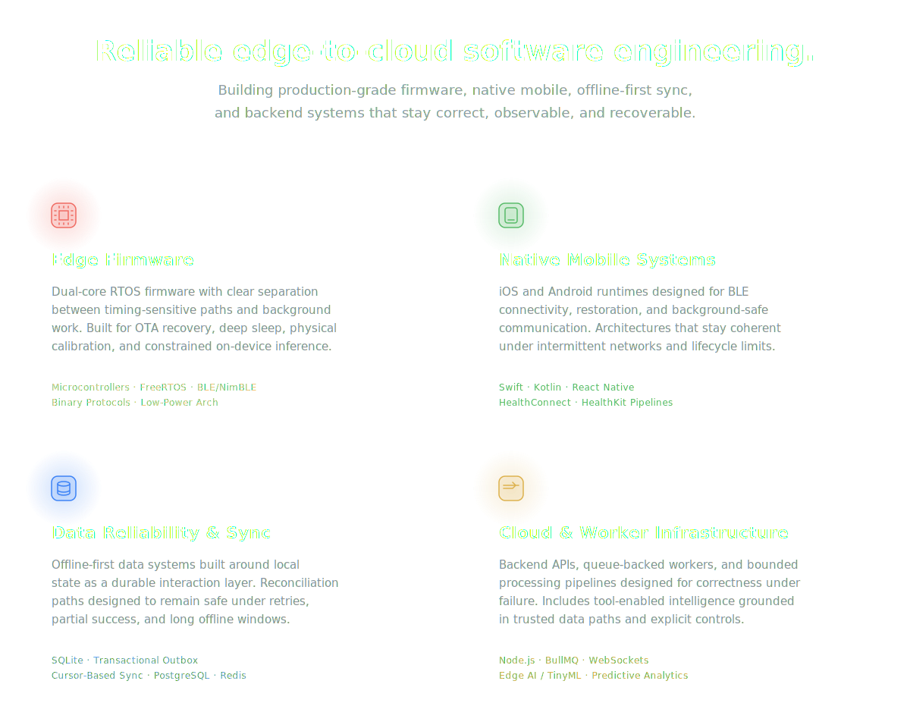
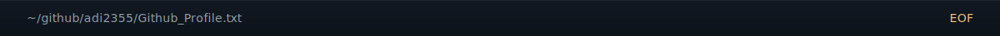

<!--
  Hi, and welcome to my GitHub profile.
  Built around production systems, connected devices, and reliability-first engineering.
-->

  

---

  

  

  

<h2 align="center">Selected Projects</h2>

<table width="100%" align="center">
  <tr>
    <td width="50%" valign="top">
       
      <h3><a href="https://github.com/adi2355/YOUR-REPO-1">ESP32-S3 Edge Firmware</a></h3>
      
Dual-core FreeRTOS firmware with binary BLE transport, OTA recovery, deep sleep, calibration logic, and on-device intelligence.

    </td>
    <td width="50%" valign="top">
       
      <h3><a href="https://github.com/adi2355/YOUR-REPO-2">Offline-First Mobile Platform</a></h3>
      
Native BLE runtime, health ingestion pipelines, SQLite-first UX, and transactional sync architecture.

    </td>
  </tr>
  <tr>
    <td width="50%" valign="top">
       
      <h3><a href="https://github.com/adi2355/YOUR-REPO-3">Device Cloud & Sync Backend</a></h3>
      
Queue-backed workers, realtime delivery, cursor sync, conflict resolution, telemetry, and reliability-focused services.

    </td>
    <td width="50%" valign="top">
       
      <h3><a href="https://github.com/adi2355/YOUR-REPO-4">TinyML Intelligence Lab</a></h3>
      
Dataset logging, baseline-vs-model evaluation, on-device inference, and personalization on constrained hardware.

    </td>
  </tr>
</table>

  

## Core Stack

**Languages**  

**Data & Storage**  

**Frameworks & Observability**  

**Infrastructure & Tooling**  

  

  <h2>Let's Connect</h2>
  
I am always open to discussing complex systems, challenging engineering problems, or compelling future opportunities.

  

    <a href="YOUR_RESUME_LINK_HERE">📄 View Resume</a> 
    &nbsp;·&nbsp;
    <a href="https://www.linkedin.com/in/aditya-khetarpal/"> LinkedIn</a>
  

  

  

