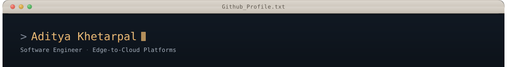
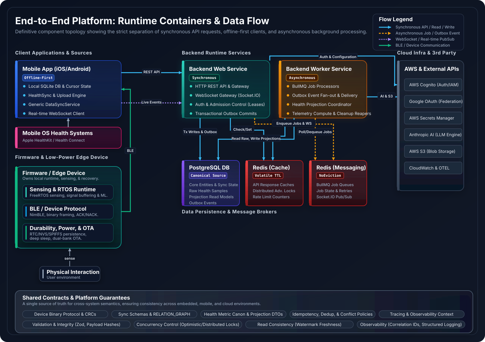

<!--
  Hi, and welcome to my GitHub profile.
  Built around production systems, connected devices, and reliability-first engineering.
-->

  

---

## Core Stack

<table>
  <tr>
    <td><strong>Languages</strong></td>
    <td>        </td>
  </tr>
  <tr>
    <td><strong>Data & Storage</strong></td>
    <td>     </td>
  </tr>
  <tr>
    <td><strong>Frameworks & Runtime</strong></td>
    <td>      </td>
  </tr>
  <tr>
    <td><strong>Observability</strong></td>
    <td>    </td>
  </tr>
  <tr>
    <td><strong>Cloud & Infra</strong></td>
    <td>     </td>
  </tr>
  <tr>
    <td><strong>CI/CD & Tooling</strong></td>
    <td>      </td>
  </tr>
</table>

---

## Engineering Philosophy

### 1. Treat local state as the durable interaction layer
Every device and client treats its own storage as ground truth. RTC ring buffers on firmware, SQLite on mobile, and transactional outboxes on the backend ensure no user action is lost to a network failure.
> Goal: The system remains functional and data-safe without any network connection.

### 2. Design for recovery, not just the happy path
OTA dual-bank rollback on firmware. Crash-safe sync cursors and conflict resolution on mobile. Dead-letter queues and idempotent replay on the backend. Every subsystem assumes failure is a runtime constant, not an edge case.
> Goal: Every failure mode has a named recovery mechanism — not a silent fallback.

### 3. Enforce idempotency at every trust boundary
Sequence numbers and CRC integrity in the BLE protocol. Cursor-based sync with deterministic conflict resolution on mobile. Request-level deduplication and transactional outbox delivery on the backend. Retries, duplicates, and reordering are expected across every boundary.
> Goal: Any operation can be safely retried without corrupting system state.

### 4. Separate concerns by timing and data semantics
Dual-core RTOS partitioning keeps sensor ISRs away from BLE negotiation. Native BLE modules isolate connection management from JavaScript orchestration. Domain event subscribers decouple side effects from API request paths. Each subsystem owns its own timing model.
> Goal: No subsystem's timing constraints leak into another's execution model.

---

## Core Domains

### Edge Firmware
Dual-core RTOS firmware with clear separation between timing-sensitive paths and background work. Built for OTA recovery, deep sleep, physical calibration, and constrained on-device inference.
> `Microcontrollers` · `FreeRTOS` · `BLE / NimBLE` · `Binary Protocols` · `Low-Power Architecture`

### Native Mobile Systems
iOS and Android runtimes designed for BLE connectivity, restoration, and background-safe device communication. Architectures that stay coherent under intermittent networks and lifecycle limits.
> `Swift` · `Kotlin` · `React Native` · `HealthConnect` · `HealthKit Ingestion Pipelines`

### Data Reliability & Sync
Offline-first data systems built around local state as a durable interaction layer. Reconciliation paths designed to remain safe under retries, partial success, and long offline windows.
> `SQLite` · `Transactional Outbox` · `Cursor-Based Sync` · `PostgreSQL` · `Redis`

### Cloud & Worker Infrastructure
Backend APIs, queue-backed workers, and bounded processing pipelines designed for correctness under failure. Includes tool-enabled intelligence grounded in trusted data paths and explicit controls.
> `Node.js` · `BullMQ` · `WebSockets` · `Edge AI / TinyML` · `Predictive Analytics`

---

## Platform Architecture

  

---

## Platform Domains

| Repository | Focus |
|:---|:---|
| [**ESP32-S3 Edge Firmware Platform**](https://github.com/adi2355/esp32-sensor-firmware-platform) | Dual-core FreeRTOS firmware with binary BLE transport, OTA recovery, deep sleep, calibration, and on-device inference |
| [**Offline-First Mobile Platform**](https://github.com/adi2355/offline-first-mobile-platform) | Native BLE runtime, HealthKit ingestion pipelines, SQLite-first UX, transactional outbox sync, and cursor-based architecture &nbsp;  |
| [**Cloud-Native Backend Platform**](https://github.com/adi2355/cloud-native-backend-platform) | Event-driven Node.js/TypeScript backend with transactional outbox, multi-device sync, idempotent health ingestion, CQRS projections, and AI with PHI redaction |
| [**Cross-Platform Shared Contracts**](https://github.com/adi2355/cross-platform-shared-contracts) | Canonical Zod schemas, sync configuration, conflict resolution rules, and health metric definitions ensuring type-safety across the platform |

---

  
Open to discussing complex systems, hard engineering problems, or compelling opportunities.

  

    
    &nbsp;
    
  

  

